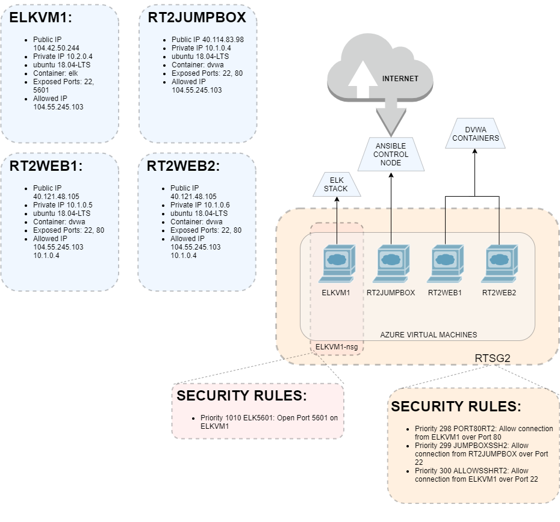
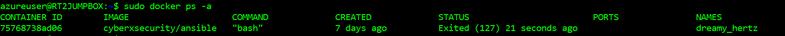

## Automated ELK Stack Deployment

The files in this repository were used to configure the network depicted below.

These files have been tested and used to generate a live ELK deployment on Azure. They can be used to either recreate the entire deployment pictured above. Alternatively, select portions of the yaml configuration files may be used to install only certain pieces of it, such as Filebeat.

  - install-elk.yml

This document contains the following details:

- Description of the Topology
- Access Policies
- ELK Configuration
  - Beats in Use
  - Machines Being Monitored
- How to Use the Ansible Build

### Description of the Topology

The main purpose of this network is to expose a load-balanced and monitored instance of DVWA, the D*mn Vulnerable Web Application.

Load balancing ensures that the application will be highly redundant, in addition to restricting access to the network.

- _Load Balancers protect the system from high load attacks such as Designated Denial of Service. Using a jumpbox is useful in restricting which areas of the system have access to the internet. Additionally, it provides a logical routine to spin up associated virtual machines on the Virtual Network._

Integrating an ELK server allows users to easily monitor the vulnerable VMs for changes to the network and system logs.

- _Filebeat watches for any significant information contained in system generated logs_
- _Metricbeat monitors the system as a whole as well as all services running on the specified server_

The configuration details of each machine may be found below.
_Note: Use the [Markdown Table Generator](http://www.tablesgenerator.com/markdown_tables) to add/remove values from the table_.

| Name       | Function         | IP Adress | Operating System |
|------------|------------------|-----------|------------------|
| RT2JUMPBOX | Gateway          | 10.1.0.4  | ubuntu 18.04-LTS |
| ELKVM1     | Elk Stack Server | 10.2.0.4  | ubuntu 18.04-LTS |
| RT2WEB1    | DVWA Web Server  | 10.1.0.5  | ubuntu 18.04-LTS |
| RT2WEB2    | DVWA Web Server  | 10.1.0.6  | ubuntu 18.04-LTS |

### Access Policies

The machines on the internal network are not exposed to the public Internet.

Only the RT2JUMPBOX machine can accept connections from the Internet. Access to this machine is only allowed from the following IP addresses:

- _104.55.245.103_

Machines within the network can only be accessed by RT2JUMPBOX via ssh protocol.

- _My local machine has access to the ELKVM1 as well as the RT2JUMPBOX (104.55.245.103 and 40.114.83.98 respectively)_

A summary of the access policies in place can be found in the table below.

| Name       | Publicly Accessible | Allowed IP Addresses |
|------------|---------------------|----------------------|
| RT2JUMPBOX | YES                 | 104.55.245.103       |
| ELKVM1     | NO                  | 104.55.245.103       |
| RT2WEB1    | NO                  | 10.1.0.4             |
| RT2WEB2    | NO                  | 10.1.0.4             |

### Elk Configuration

Ansible was used to automate configuration of the ELK machine. No configuration was performed manually, which is advantageous because...

- _This guarantees consistency across machines and reduces chance of human error_

The playbook implements the following tasks:

- _Install Docker_
- _Install pip3 (Pythons package manager)_
- _Install Docker's python module_

The following screenshot displays the result of running `docker ps` after successfully configuring the ELK instance.

### Target Machines & Beats

This ELK server is configured to monitor the following machines:

- _10.1.0.5 and 10.1.0.6_

We have installed the following Beats on these machines:

- _Filebeat and Metricbeat_

These Beats allow us to collect the following information from each machine:

- _Filebeat collects relevent system logs from the virtual machines and Metricbeat monitors their performance as well as their running services_

### Using the Playbook

In order to use the playbook, you will need to have an Ansible control node already configured. Assuming you have such a control node provisioned:

SSH into the control node and follow the steps below:

- Copy the install-elk.yml file to /etc/ansible/
- Update the ansible.cfg file to include remote_user = azureuser
- Run the playbook, and navigate to  http://[your.VM.IP]:5601/app/kibana to check that the installation worked as expected.

_As a **Bonus**, provide the specific commands the user will need to run to download the playbook, update the files, etc._